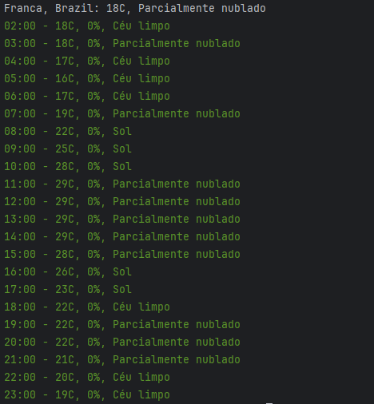

## 🌦️ Previsão do Tempo CLI em Go
Este é um aplicativo de linha de comando simples em Go para obter a previsão do tempo atual e horária para uma localização específica, com destaque para a probabilidade de chuva.



## ✨ Funcionalidades
Exibe o **nome da cidade e país**.

Permite especificar a **cidade desejada** como argumento na linha de comando.

Mostra a **temperatura atual** em Celsius e a **condição do tempo**.

Apresenta a **previsão horária** para as próximas horas do dia, incluindo temperatura, condição e **probabilidade de chuva**.

Utiliza cores para indicar a probabilidade de chuva:

**Verde**: Baixa probabilidade de chuva (abaixo de 40%).

**Vermelho**: Alta probabilidade de chuva (40% ou mais).

## 🚀 Como Usar
### Pré-requisitos
Certifique-se de ter o **Go** instalado na sua máquina. Você pode baixá-lo e instalá-lo em [go.dev](https://go.dev/).

### Chave de API
Este projeto utiliza a API de previsão do tempo do WeatherAPI.com. Você precisará de uma chave de API para que o aplicativo funcione.

**Importante**: No código fornecido, a chave de API está **hardcoded** como `SUA_CHAVE_AQUI`. **É crítico que você substitua esta chave pela sua chave de API real** obtida em [weatherapi.com](https://www.weatherapi.com/).

```go
res, err := http.Get(
"https://api.weatherapi.com/v1/forecast.json?q=" + q + "&days=1&key=SUA_CHAVE_AQUI&lang=pt"
)
```

### Instalação e Execução

1. **Clone o repositório** (ou salve o código em um arquivo `.go`, por exemplo, `main.go`).
2. Instale a dependência de cores:
``` bash
go get github.com/fatih/color
```
3. Execute o aplicativo:
- Para Previsão Padrão (Franca)
``` bash
go run main.go
```
- Para Previsão de outra cidade (Ex. São Paulo) digite sem aspas, sem acentos e separadas por hífen (`-`):
``` bash
go run main.go sao-paulo
```


Você também pode usar `go run .` se o arquivo for `main.go` e você estiver na pasta raiz do projeto.

4. Você verá a previsão do tempo no seu terminal.

## ⚙️ Estrutura do Código

- `main.go`: Contém a lógica principal do programa.
  - Define a estrutura `Weather` para mapear a resposta JSON da API.
  - Faz uma requisição HTTP para a WeatherAPI, usando a cidade fornecida ou "Franca" como padrão.
  - Processa a resposta JSON e extrai as informações relevantes.
  - Formata e imprime a previsão atual e horária, usando o pacote `color` para destacar a probabilidade de chuva.
- **API URL**: A URL da API está fixada com o idioma português (`lang=pt`).

## 🤝 Contribuição
Contribuições são bem-vindas! Se você tiver sugestões, melhorias ou encontrar bugs, sinta-se à vontade para abrir uma issue ou enviar um pull request.

## 📄 Licença
Este projeto está licenciado sob a Licença MIT. Veja o arquivo [LICENSE](https://#) para mais detalhes (se você for criar um).